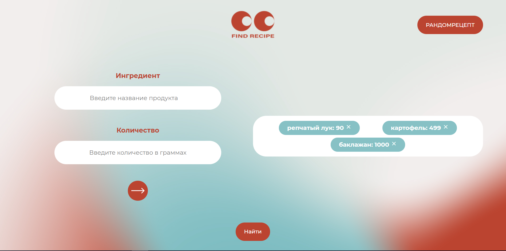

<h1 align="center">Web-Refrigerator</h1>

<h2 align="center">
  <a href="https://nikulin-andrey.github.io/Web-Refrigerator/">Live Demo on GitHab Pages</a>
</h2>

## Description
Этот проект создан для моего портфолио. Сайт представляет из себя приложение для поиска рецептов с возможностью подбора случайных рецептов.

На первом экране имеется два поля ввода, с помощью которых можно добавить выбранный рецепт с заданной массой, после добавления первого рецепта появлятся кнопка *"Найти"*.
При клике на неё в списке рецептов остаются те рецепты, чей состав полностью укладывается во введенный пользователем список или помеченные *"немного не подходит"*, 
в которых есть все ингредиенты из выбранного списка, но объем превышает тот, что ввел пользователь - не более 25% на каждый ингредиент.
Список рецептов это слайдер карточек, при клике на которые открывается выбранный рецепт.
Изначально в списке рецептов отображаются все доступные рецепты. Также на первом экране есть кнопта *"РАНДОМРЕЦЕПТ"*, при клике на которую открывается случайный рецепт,
загруженный с помощью AJAX с [Free Meal API](https://www.themealdb.com/api.php). 

## About the project

### Основные технологии:

- **HTML** + **CSS**
- **JavaScript**
- **Git**
- **Node.js**
- **AJAX**
- **WebPack**
- **Swiper**

Приложение имеет модульную архитектуру, сборщик - **WebPack**. Также при разработке было принято решение добавить слайдер, рассматривались технологии **Slick slider** и **Swiper**. В итоге я выбрал **Swiper**, т. к. для работы **Slick slider** необходимо подключать библиотеку **JQuery**, что является невыгодным решением, т. к. **JQuery** я в проекте не использую и не хотел замедлять приложение подключением дополнительной большой библиотеки. **AJAX** используется, чтобы получить данные с [Free Meal API](https://www.themealdb.com/api.php) для подбора случайного рецепта.
